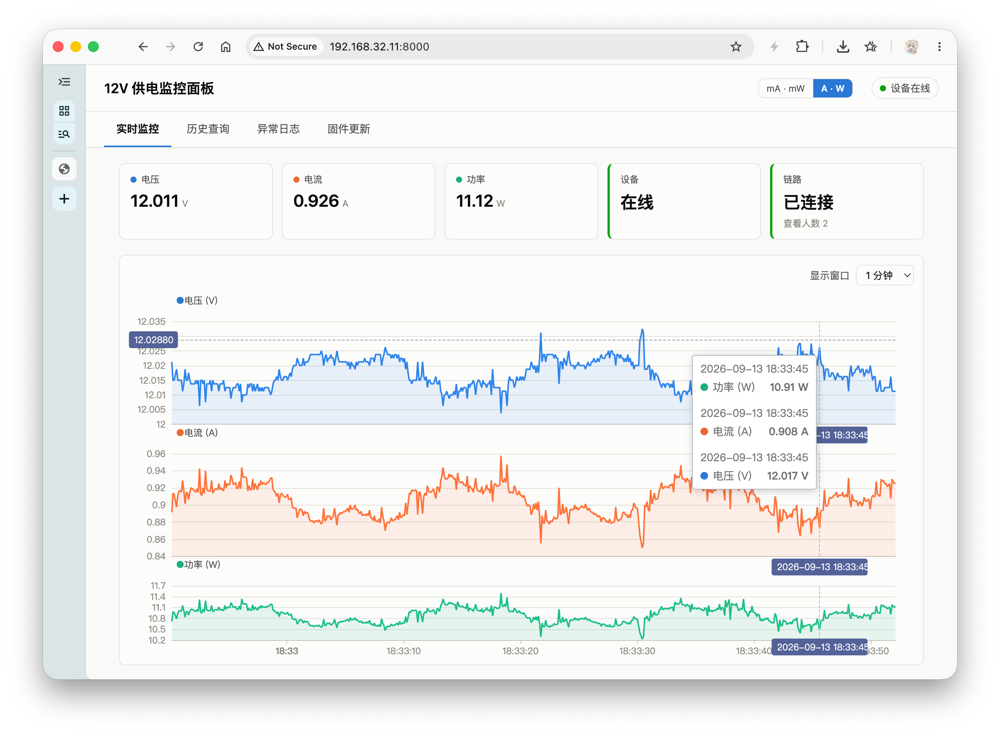

# dynamic-power-monitor-backend

[English](README.md) | [中文](README_zh.md)

[12V 供电监测系统](https://github.com/FibreCase/dynamic-power-monitor) 的
**异步 TCP 接收 + FastAPI** 后端，附带一个 Web 监控面板。它通过一条长连接 TCP
从 ESP32-C3 接收固定大小的二进制帧，持久化到 SQLite，再通过 WebSocket（实时）和
HTTP 接口（历史、OTA、过流告警）提供给浏览器。

本目录是一个独立组件（独立的 git 仓库，以 **git 子模块**形式嵌入
[`dynamic-power-monitor`](https://github.com/FibreCase/dynamic-power-monitor)）。
ESP32 固件与完整硬件上下文在父仓库中 —— 线格式与设备侧细节见其 `README.md` /
`CLAUDE.md`。



## 功能

- **接收（Ingest）** —— 把粘包 / 拆包的 TCP 字节流重组为固定大小的上游帧
  （20 字节**采样**、37 字节**设备信息**、25 字节**OCP 事件**），逐帧校验校验和。
- **持久化（Persist）** —— 经队列解耦的批量写器把采样写入 SQLite（WAL），接收不会
  被磁盘写入阻塞。
- **广播（Broadcast）** —— 每条采样都以全速率推给 WebSocket 查看者；第一个查看者
  上线时把设备切到 10 Hz 采样，最后一个离开时降回 0.1 Hz。
- **过流检测（OCP）** —— 判断采样电流是否超过配置阈值（OCP 的后端一半；固件的
  INA226 ALERT 是另一半），并记录事件。
- **OTA** —— 保存上传的固件 `.bin`，并托管在设备要下载的路径上；一次调用即可触发
  设备升级。
- **托管面板** —— 把构建后的 `web/` 资源以同源方式挂载在 `/`。

## 依赖

- Python ≥ 3.10，使用 [uv](https://docs.astral.sh/uv/) 管理
- Node.js + npm（仅当需要构建 / 开发 `web/` 面板时）

## 快速开始

```bash
uv sync
uv run power-monitor
```

- **TCP 接收** 监听端口 `38888` —— 把固件的 `CFG_HOST_IP`/`CFG_HOST_PORT` 指向本机。
- **`ws://<host>:38000/ws`** —— 实时采样广播。
- **`GET /api/v1/history?start_ts=&end_ts=&limit=`** —— 持久化采样，按时间降序（`limit` 默认 500，最大 5000）。
- **`GET /api/v1/alerts?start_ts=&end_ts=&limit=`** —— 过流事件，按时间降序（`limit` 默认 200，最大 1000）。
- **`GET /ota/status`** —— `{available, size, mtime, device_online, firmware_version, ota_slot}`。
- **`POST /ota/upload`**（multipart `file`）、**`POST /ota/update`**、**`GET /ota/firmware.bin`** —— OTA 上传 / 触发 / 下载。
- **`GET /healthz`** —— `{"status", "device": <bool>, "viewers": <int>}`。
- **`GET /`** —— 面板（构建后，见下文）。

## 配置

所有可调项都是 `PM_*` 环境变量（见 `power_monitor/config.py`）：

| 变量 | 默认值 | 含义 |
|---|---|---|
| `PM_TCP_HOST` | `0.0.0.0` | TCP 接收绑定地址 |
| `PM_TCP_PORT` | `38888` | TCP 接收端口（ESP32 连接到这里） |
| `PM_HTTP_HOST` | `0.0.0.0` | 面板/API 监听地址（uvicorn） |
| `PM_HTTP_PORT` | `38000` | 面板/API + WebSocket + OTA 端口（uvicorn） |
| `PM_DB_PATH` | `data/power.db` | SQLite 文件路径 |
| `PM_INTERVAL_FAST_MS` | `100` | 有查看者时下发的采样间隔（10 Hz） |
| `PM_INTERVAL_SLOW_MS` | `10000` | 空闲时下发的采样间隔（0.1 Hz） |
| `PM_DEVICE_LIVENESS_S` | `30` | 设备"在线"需满足：TCP 已连接 *且* 在这么多秒内收到过帧 |
| `PM_DB_BATCH_SIZE` | `50` | 每次批量提交行数 |
| `PM_DB_FLUSH_INTERVAL` | `2.0` | 部分批次最多等待的秒数 |
| `PM_DB_STORE_INTERVAL_MS` | `10000` | 采样写入 SQLite 的最大速率，与实时采样速率无关（每条采样仍全速率经 `/ws` 广播） |
| `PM_OCP_THRESHOLD_MA` | `2500` | 后端过流阈值（mA）—— OCP 的后端一半 |
| `PM_OCP_REARM_MS` | `5000` | 持续过流时两次记录之间的最小间隔（防抖） |
| `PM_WEB_DIST` | `web/dist` | 托管在 `/` 的面板资源（缺失时告警跳过） |
| `PM_OTA_DIR` | `ota/` | 上传的固件 `.bin` 存储目录 |
| `PM_OTA_BIN_NAME` | `firmware.bin` | 存储的镜像文件名（在 `/ota/<name>` 处托管） |

## 项目结构

```
power_monitor/
├── protocol.py   # 线格式：20 字节采样、37 字节设备信息、25 字节 OCP 事件、8 字节控制帧
├── tcp.py        # IngestServer：asyncio TCP 服务，按帧头分发重组，在线(liveness)+keepalive
├── db.py         # SQLite (WAL)：power_logs + ocp_events，队列解耦的批量写器
├── app.py        # FastAPI：/ws、/api/v1/history、/api/v1/alerts、/ota/*、/healthz + 面板静态挂载
├── config.py     # PM_* 环境变量
└── cli.py        # `power-monitor` 入口（运行 uvicorn）
web/              # React + Vite + ECharts 面板
scripts/
└── watch_ws.py   # 示例：在终端里 tail 实时 /ws 数据流
tests/
└── e2e.py        # 假 ESP32 走 TCP + WS 查看者，无需硬件
```

## 监控面板（`web/`）

四页签单页应用 —— **实时监控**（实时，WebSocket 驱动曲线）、**历史查询**（历史数据）、
**异常日志**（过流记录）、**固件更新**（OTA）—— 使用 React、Vite、ECharts 构建。

```bash
cd web
npm install
npm run build       # -> web/dist/，由后端在 "/" 处托管
```

对着一个运行中的后端跑热更新开发：

```bash
cd web
npm run dev         # http://localhost:5173，代理 /api、/ws、/healthz、/ota -> :38000
```

## 测试

```bash
uv run python -m tests.e2e
```

拉起真实的 `IngestServer`/`Database`/FastAPI 应用，通过 TCP 喂入假上游帧，端到端检查
WS 广播、下行采样间隔控制、历史、OTA，以及两条 OCP 检测路径（设备 ALERT 事件 + 后端
阈值，含边沿触发的去重）—— 全程无需硬件。

## 脚本

```bash
uv run python scripts/watch_ws.py               # tail ws://127.0.0.1:38000/ws
uv run python scripts/watch_ws.py --raw          # 打印原始 JSON
uv run python scripts/watch_ws.py --url ws://<host>:38000/ws
```
